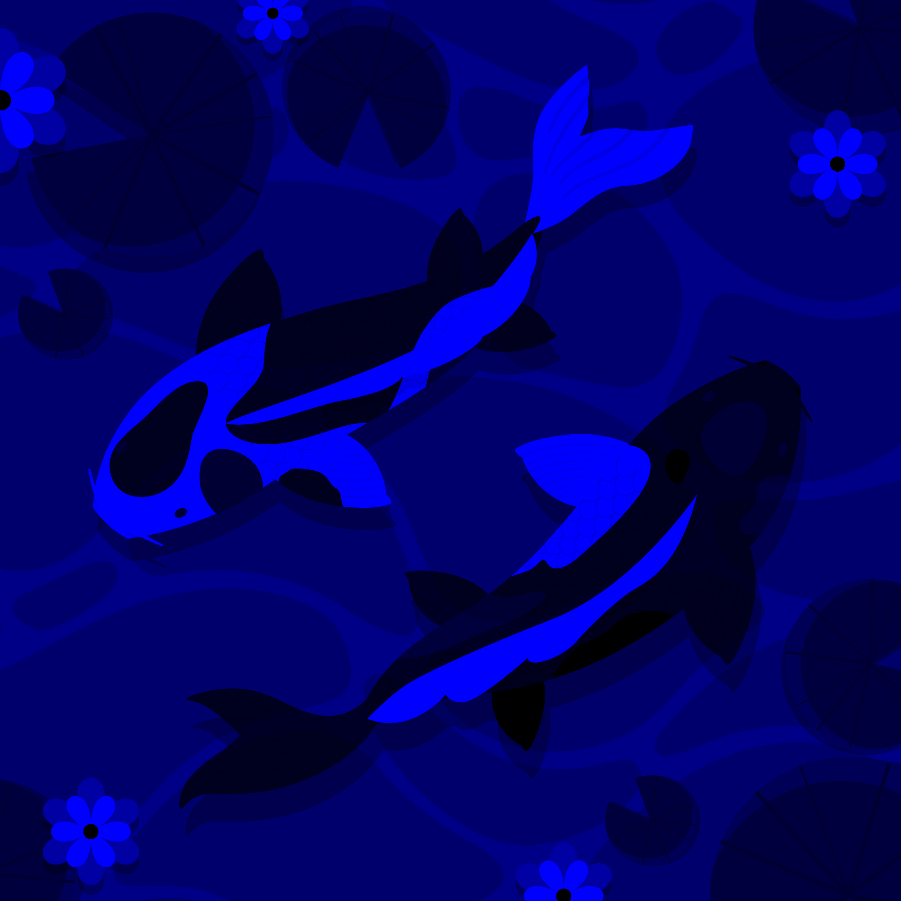
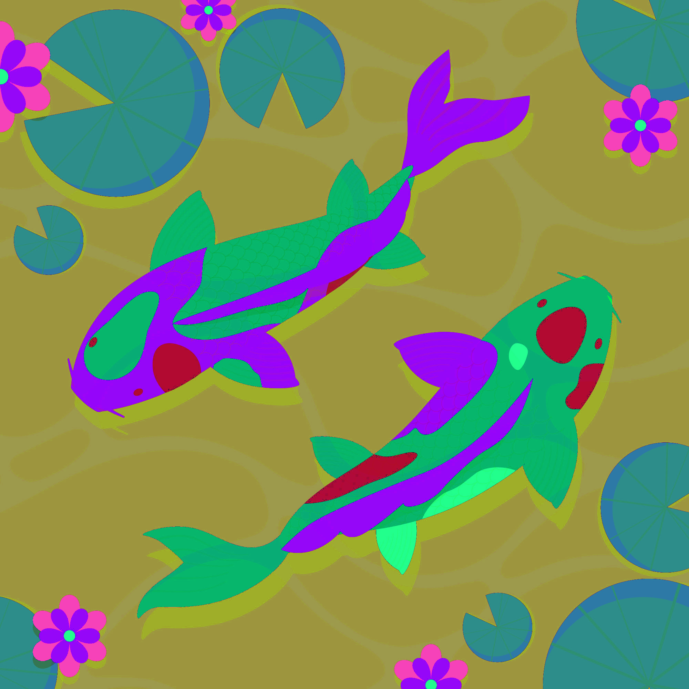
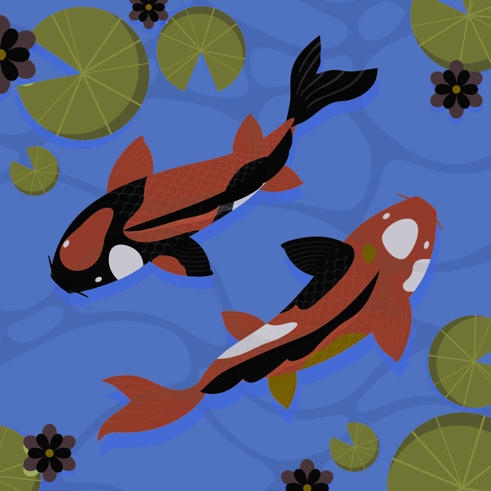
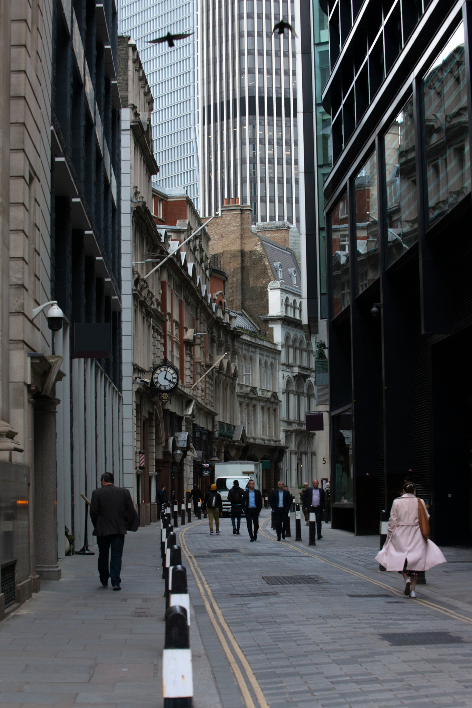
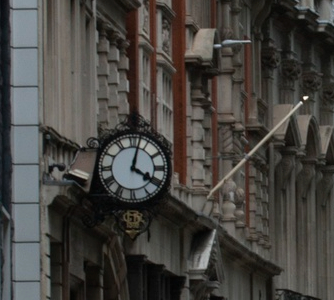
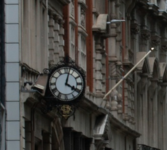
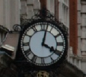
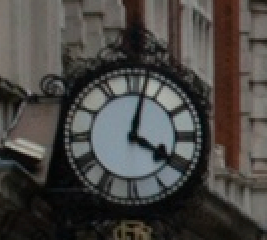
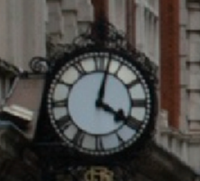

# OAVI_lab1
kfmlkdmf
_Цветовые модели и изменение размера изображений_

Была поставлена следующая задача:

### Цветовые модели
1. Выделить компоненты R, G, B и сохранить как отдельные изображения.
2. Привести изображение к цветовой модели HSI, сохранить яркостную компоненту как отдельное изображение.
3. Инвертировать яркостную компоненту в исходном изображении, сохранить производное изображение.

### Передискретизация
1. Растяжение (интерполяция) изображения в M раз.
2. Сжатие (децимация) изображения в N раз.
3. Передискретизация изображения в K=M/N раз путём растяжения и последующего сжатия (в два прохода).
4. Передискретизация изображения в K раз за один проход.

***

## Функции

Функции для первой части данной задачи находятся в файле `color_models.py`.

- `selectRGB(filename: str, redFilename: str, greenFilename: str, blueFilename: str)`
    > Выделяет R, G, B компоненты из изображения и сохраняет их в новые файлы.
    >
    > _ПАРАМЕТРЫ:_
    >    * **filename** - Имя файла с исходным изображением.
    >    * **redFilename** - Имя файла с красным компонентом исходного изображения.
    >    * **greenFilename** - Имя файла с зеленым компонентом исходного изображения.
    >    * **blueFilename** - Имя файла с синим компонентом исходного изображения.

- `gatherRGB(redFilename: str, greenFilename: str, blueFilename: str, resultFilename: str)`
    > Собирает исходное изображение из сохраненных компонентов для проверки результата.
    >
    > _ПАРАМЕТРЫ:_
    >    * **redFilename** - Имя файла с красным компонентом исходного изображения.
    >    * **greenFilename** - Имя файла с зеленым компонентом исходного изображения.
    >    * **blueFilename** - Имя файла с синим компонентом исходного изображения.
    >    * **resultFilename** - Имя файла с собранным изображением из заданных компонентов.

- `convertHSI(filename: str, HSIFilename: str, intensityFilename: str)`
    > Преобразует изображение в цветовую модель HSI и сохраняет компонент яркости как отдельное изображение.
    >
    > _ПАРАМЕТРЫ:_
    >    * **filename** - Имя файла с исходным изображением.
    >    * **HSIFilename** - Имя результирующего файла с изображением в цветовой модели HSI.
    >    * **intensityFilename** - Имя файла с компонентом яркости исходного изображения.

- `HSItoRGB(H: int, S: int, I: int)`
    > Вычисляет цветовые координаты RGB на основе цветовых координат HSI.
    >
    > _ПАРАМЕТРЫ:_
    >    * **H, S, I** - Цветовые координаты пикселя в цветовой модели HSI.

- `invertIntensity(HSIFilename: str, invIntensFilename: str, checkConvertFilename: str, invIntensHSIFilename: str)`
    > Инвертирует компонент яркости в исходном изображении и сохраняет полученное изображение.
    >
    > _ПАРАМЕТРЫ:_
    >    * **HSIFilename** - Имя файла с исходным изображением в цветовой модели HSI.
    >    * **invIntensFilename** - Имя результирующего файла с изображением с инвертированным компонентом яркости в цветовой модели RGB.
    >    * **checkConvertFilename** - Имя результирующего файла с преобразованным исходным HSI-изображением из HSI в цветовую модель RGB.
    >    * **invIntensHSIFilename** - Имя результирующего файла с изображением с инвертированным компонентом яркости в цветовой модели HSI.

Функции для второй части данной задачи находятся в файле `resampling.py`.

- `upNearest(filename: str, m: float, resultFilename: str)`
    > Интерполирует изображение методом ближайшего соседа.
    >
    > _ПАРАМЕТРЫ:_
    >    * **filename** - Имя файла с исходным изображением.
    >    * **m** - Масштаб интерполяции.
    >    * **resultFilename** - Имя файла с результирующим интерполированным изображением.

- `upBilinear(filename, m, resultFilename)`
    > Интерполирует изображение билинейным методом.
    >
    > _ПАРАМЕТРЫ:_
    >    * **filename** - Имя файла с исходным изображением.
    >    * **m** - Масштаб интерполяции.
    >    * **resultFilename** - Имя файла с результирующим интерполированным изображением.
- `downNearest(filename, n, resultFilename)`
    > Уменьшает разрешение изображения методом ближайшего соседа.
    >
    > _ПАРАМЕТРЫ:_
    >    * **filename** - имя файла с исходным изображением.
    >    * **n** - масштаб уменьшения разрешения.
    >    * **resultFilename** - имя файла с изображением с уменьшенным разрешением.

- `downArea(filename, n, resultFilename)`
    > Уменьшает разрешение изображения методом пересчета площади пикселей.
    >
    > _ПАРАМЕТРЫ:_
    >    * **filename** - Имя файла с исходным изображением.
    >    * **n** - Масштаб уменьшения разрешения.
    >    * **resultFilename** - Имя файла с изображением с уменьшенным разрешением.

- `twoPassResampling(filename, m, n, resultFilename)`
    > Изменяет размер изображения в K=M/N раз с помощью растяжения и последующего сжатия (в два прохода).
    > 
    > _ПАРАМЕТРЫ:_
    >    * **filename** - Имя файла с исходным изображением.
    >    * **m** - Масштаб интерполяции.
    >    * **n** - Масштаб уменьшения разрешения.
    >    * **resultFilename** - Имя файла с изображением с измененным размером.

- `singlePassResampling(filename, m, n, resultFilename)`
    > Изменяет размер изображения в K раз за один проход.
    > 
    > _ПАРАМЕТРЫ:_
    >    * **filename** - Имя файла с исходным изображением.
    >    * **m** - Масштаб интерполяции.
    >    * **n** - Масштаб уменьшения разрешения.
    >    * **resultFilename** - Имя файла с изображением с измененным размером.

---

# Работа программы

## Цветовые модели

### Оригинальное изображение:

### R, G, B компоненты:

<table>
  <tr>
    <td></td>
    <td></td>
    <td></td>
  </tr>
</table>

### HSI:

<table>
  <tr>
    <td>
      <figure>
        
        <figcaption>RGB -> HSI</figcaption>
      </figure></td>
    <td>
      <figure>
        
        <figcaption>Компонента яркости</figcaption>
      </figure></td>
    <td>
      <figure>
        
        <figcaption>RGB с инвертированной яркостью</figcaption>
      </figure></td>
  </tr>
</table>

## Передискретизация

### Оригинальное изображение:

### Сжатие:

<table>
  <tr>
    <td>
      <figure>
        
        <figcaption>Оригинал</figcaption>
      </figure></td>
    <td>
      <figure>
        
        <figcaption>x0.5</figcaption>
      </figure></td>
    <td>
      <figure>
        
        <figcaption>x0.3</figcaption>
      </figure></td>
  </tr>
</table>

### Растяжение:

<table>
  <tr>
    <td>
      <figure>
        
        <figcaption>Оригинал</figcaption>
      </figure></td>
    <td>
      <figure>
        
        <figcaption>x1.3</figcaption>
      </figure></td>
    <td>
      <figure>
        
        <figcaption>x2</figcaption>
      </figure></td>
  </tr>
</table>

### Передискретизация в один проход:

<table>
  <tr>
    <td>
      <figure>
        
        <figcaption>x0.3</figcaption>
      </figure></td>
    <td>
      <figure>
        
        <figcaption>Оригинал</figcaption>
      </figure></td>
    <td>
      <figure>
        
        <figcaption>x1.6</figcaption>
      </figure></td>
  </tr>
</table>

### Передискретизация в два прохода:

<table>
  <tr>
    <td>
      <figure>
        
        <figcaption>x0.7</figcaption>
      </figure></td>
    <td>
      <figure>
        
        <figcaption>Оригинал</figcaption>
      </figure></td>
    <td>
      <figure>
        
        <figcaption>x1.6</figcaption>
      </figure></td>
  </tr>
</table>

